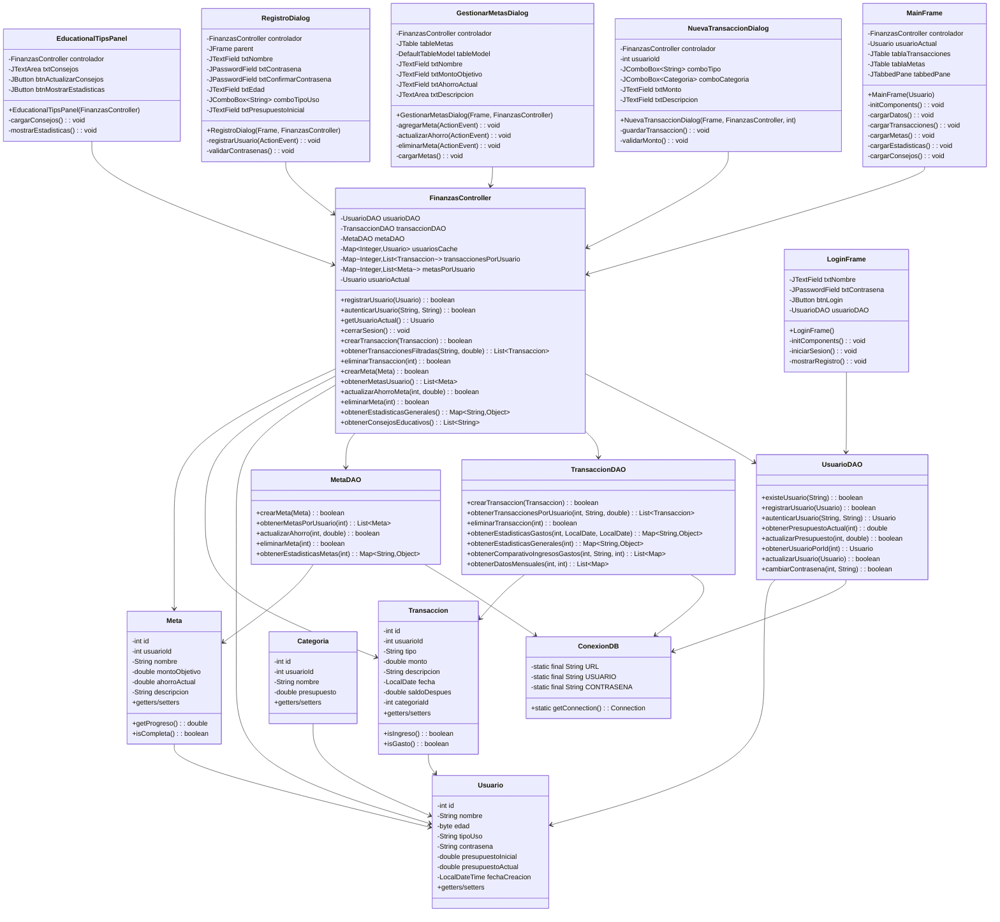

# 📋 Diagrama de Clases UML

## Arquitectura General



## Relaciones de Dependencia

- **FinanzasController** es el núcleo de la aplicación, coordinando todas las operaciones
- **DAOs** manejan la persistencia, accediendo a la base de datos a través de **ConexionDB**
- **Vistas** dependen del **FinanzasController** para lógica de negocio
- **Modelos** representan las entidades de datos y son usados por todos los componentes

## Colecciones Utilizadas

```java
// Cache de usuarios
Map<Integer, Usuario> usuariosCache

// Transacciones por usuario
Map<Integer, List<Transaccion>> transaccionesPorUsuario

// Metas por usuario
Map<Integer, List<Meta>> metasPorUsuario

// Categorías por usuario
Map<Integer, List<Categoria>> categoriasPorUsuario
```

## Principios SOLID Aplicados

1. **S** - Single Responsibility: Cada clase tiene una responsabilidad específica
2. **O** - Open/Closed: El controlador puede extenderse sin modificarse
3. **L** - Liskov Substitution: Las vistas pueden intercambiarse
4. **I** - Interface Segregation: Interfaces específicas por funcionalidad
5. **D** - Dependency Inversion: Dependencia de abstracciones, no de concretos