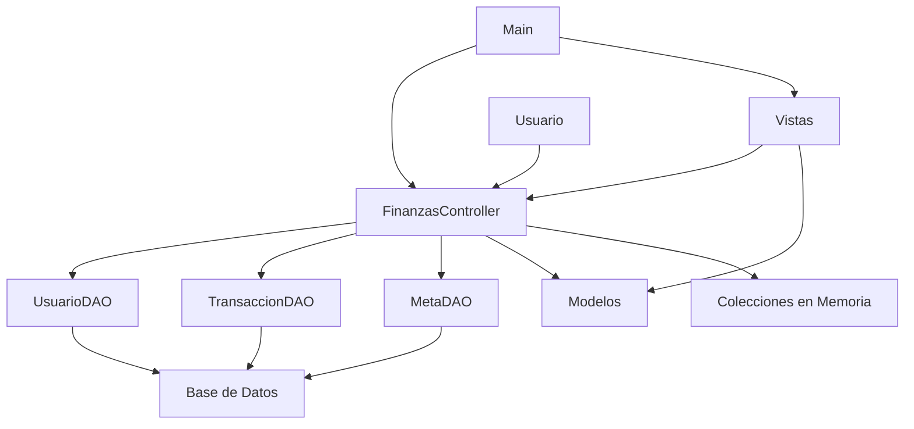

# 📦 Diagrama de Paquetes UML

## Estructura General de Paquetes

```mermaid
packageDiagram
    %% Paquete Principal
    package "finanzas" {
        class Main
        class MainTerminal
    }

    %% Capa de Controlador
    package "finanzas.controlador" {
        class FinanzasController
    }

    %% Capa de Modelo
    package "finanzas.modelo" {
        class Usuario
        class Transaccion
        class Meta
        class Categoria
    }

    %% Capa de Datos
    package "finanzas.dao" {
        class ConexionDB
        class UsuarioDAO
        class TransaccionDAO
        class MetaDAO
    }

    %% Capa de Vista
    package "finanzas.vista" {
        class LoginFrame
        class MainFrame
        class NuevaTransaccionDialog
        class GestionarMetasDialog
        class RegistroDialog
        class EducationalTipsPanel
    }

    %% Dependencias entre paquetes
    finanzas --> finanzas.controlador
    finanzas --> finanzas.vista

    finanzas.controlador --> finanzas.modelo
    finanzas.controlador --> finanzas.dao

    finanzas.vista --> finanzas.controlador
    finanzas.vista --> finanzas.modelo

    finanzas.dao --> finanzas.modelo
    finanzas.dao --> java.sql
    finanzas.dao --> java.util

    finanzas.vista --> javax.swing
    finanzas.vista --> java.awt

    finanzas.controlador --> java.util
    finanzas.modelo --> java.time
```

## Detalle de Dependencias por Paquete

### 📁 finanzas (Paquete Principal)
**Responsabilidades:**
- Punto de entrada de la aplicación
- Inicialización del sistema
- Configuración del Look and Feel

**Dependencias:**
- `finanzas.controlador` - Para lógica de negocio
- `finanzas.vista` - Para interfaz de usuario

### 🎮 finanzas.controlador (Capa de Control)
**Responsabilidades:**
- Coordinar operaciones entre vista y modelo
- Gestionar lógica de negocio
- Mantener estado de la aplicación
- Validar operaciones
- Gestionar cache en memoria

**Dependencias:**
- `finanzas.modelo` - Para entidades de datos
- `finanzas.dao` - Para persistencia
- `java.util` - Para colecciones (Map, List, etc.)

**Colecciones utilizadas:**
```java
Map<Integer, Usuario> usuariosCache
Map<Integer, List<Transaccion>> transaccionesPorUsuario
Map<Integer, List<Meta>> metasPorUsuario
Map<Integer, List<Categoria>> categoriasPorUsuario
```

### 📊 finanzas.modelo (Capa de Modelo)
**Responsabilidades:**
- Representar entidades de negocio
- Encapsular datos y comportamiento
- Validar estado interno
- Proporcionar métodos de acceso

**Dependencias:**
- `java.time` - Para fechas (LocalDate, LocalDateTime)

**Entidades principales:**
- `Usuario` - Datos del usuario y presupuesto
- `Transaccion` - Ingresos y gastos
- `Meta` - Objetivos de ahorro
- `Categoria` - Clasificación de gastos

### 💾 finanzas.dao (Capa de Datos)
**Responsabilidades:**
- Acceso a base de datos
- Operaciones CRUD
- Consultas complejas
- Manejo de conexiones
- Transformación de datos

**Dependencias:**
- `finanzas.modelo` - Para entidades
- `java.sql` - Para JDBC
- `java.util` - Para colecciones

**Patrones utilizados:**
- **DAO Pattern** - Separación de lógica de acceso a datos
- **Singleton** - Para conexión de base de datos
- **Factory** - Para creación de objetos de modelo

### 🖥️ finanzas.vista (Capa de Vista)
**Responsabilidades:**
- Interfaz de usuario
- Captura de eventos
- Presentación de datos
- Validación de entrada
- Navegación entre pantallas

**Dependencias:**
- `finanzas.controlador` - Para operaciones
- `finanzas.modelo` - Para datos a mostrar
- `javax.swing` - Para componentes GUI
- `java.awt` - Para layouts y eventos

**Componentes principales:**
- `LoginFrame` - Autenticación
- `MainFrame` - Interfaz principal con pestañas
- `NuevaTransaccionDialog` - Formulario de transacciones
- `GestionarMetasDialog` - Gestión de metas
- `RegistroDialog` - Registro de usuarios
- `EducationalTipsPanel` - Consejos educativos

## Arquitectura MVC Implementada



## Flujo de Dependencias

1. **Vista** solicita operación al **Controlador**
2. **Controlador** valida y procesa la solicitud
3. **Controlador** utiliza **DAOs** para persistencia
4. **DAOs** acceden a **Base de Datos**
5. **Controlador** actualiza **colecciones en memoria**
6. **Controlador** retorna resultado a **Vista**
7. **Vista** actualiza interfaz con nuevos datos

## Beneficios de la Arquitectura

### ✅ Separación de Responsabilidades
- Cada paquete tiene una responsabilidad clara
- Fácil mantenimiento y evolución
- Código más testable

### ✅ Bajo Acoplamiento
- Dependencias unidireccionales
- Interfaces claras entre capas
- Fácil reemplazo de implementaciones

### ✅ Alta Cohesión
- Clases relacionadas agrupadas
- Funcionalidad concentrada
- Lógica de negocio centralizada

### ✅ Reutilización
- Componentes reutilizables
- Interfaces consistentes
- Módulos independientes

## Consideraciones de Diseño

### Inversión de Dependencias
- El controlador no depende de implementaciones concretas
- Los DAOs son intercambiables
- Las vistas pueden cambiar sin afectar la lógica

### Gestión de Estado
- Estado centralizado en el controlador
- Cache en memoria para rendimiento
- Sincronización automática con base de datos

### Manejo de Errores
- Validaciones en múltiples niveles
- Mensajes de error consistentes
- Recuperación de errores graceful