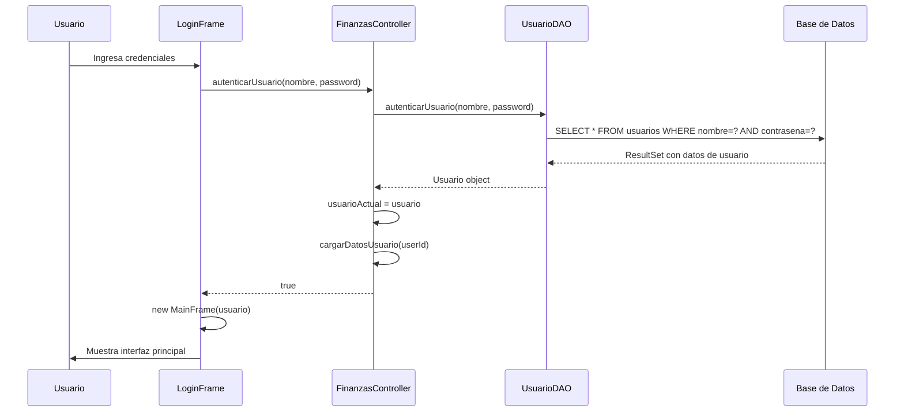
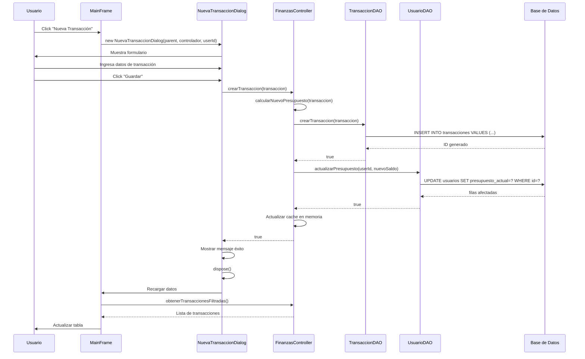
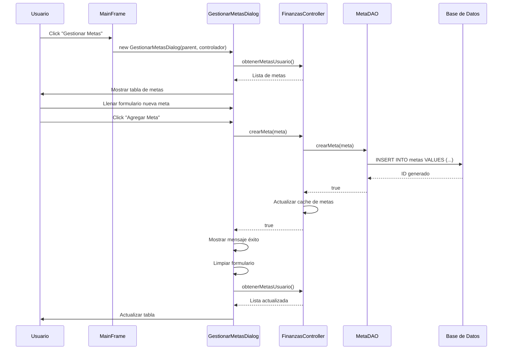
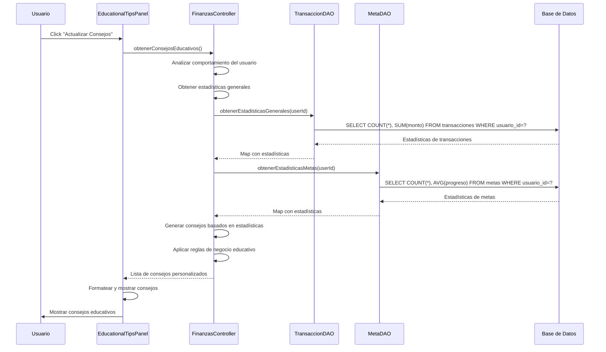
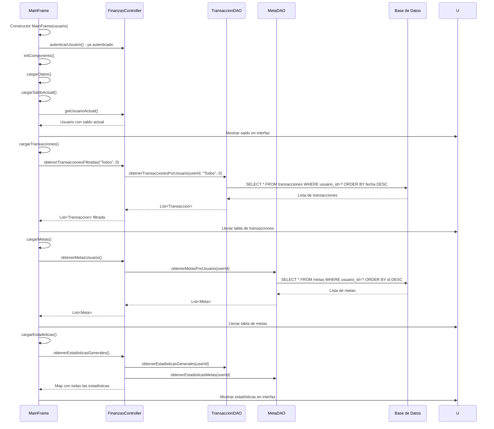
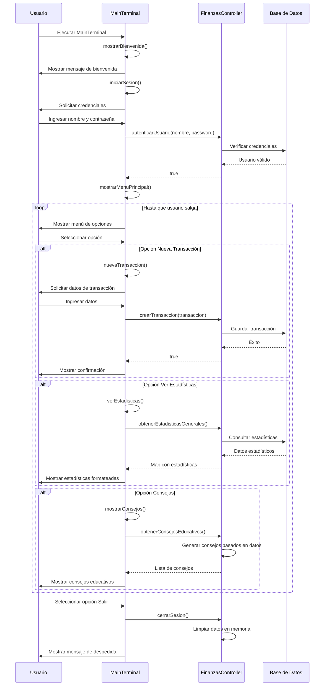

# 🔄 Diagrama de Secuencia UML

## Proceso de Inicio de Sesión

## Creación de Nueva Transacción

## Gestión de Metas

## Obtención de Consejos Educativos

## Carga de Datos al Iniciar

## Flujo de Terminal Interactiva

## Patrón de Interacción General

1. **Vista** → **Controlador**: Solicitud de operación
2. **Controlador** → **DAO**: Consulta/Actualización de datos
3. **DAO** → **Base de Datos**: Operación SQL
4. **Base de Datos** → **DAO**: Resultado de operación
5. **DAO** → **Controlador**: Datos procesados
6. **Controlador** → **Vista**: Resultado final
7. **Vista** → **Usuario**: Presentación de resultados

Este flujo asegura separación de responsabilidades y mantenibilidad del código.