# 🔄 Diagrama de Secuencia UML

## Proceso de Inicio de Sesión

## Creación de Nueva Transacción

```mermaid
sequenceDiagram
    participant U as Usuario
    participant MF as MainFrame
    participant NTD as NuevaTransaccionDialog
    participant FC as FinanzasController
    participant TD as TransaccionDAO
    participant UD as UsuarioDAO
    participant DB as Base de Datos

    U->>MF: Click "Nueva Transacción"
    MF->>NTD: new NuevaTransaccionDialog(parent, controlador, userId)
    NTD->>U: Muestra formulario

    U->>NTD: Ingresa datos de transacción
    U->>NTD: Click "Guardar"

    NTD->>FC: crearTransaccion(transaccion)
    FC->>FC: calcularNuevoPresupuesto(transaccion)
    FC->>TD: crearTransaccion(transaccion)
    TD->>DB: INSERT INTO transacciones VALUES (...)
    DB-->>TD: ID generado
    TD-->>FC: true

    FC->>UD: actualizarPresupuesto(userId, nuevoSaldo)
    UD->>DB: UPDATE usuarios SET presupuesto_actual=? WHERE id=?
    DB-->>UD: filas afectadas
    UD-->>FC: true

    FC->>FC: Actualizar cache en memoria
    FC-->>NTD: true

    NTD->>NTD: Mostrar mensaje éxito
    NTD->>NTD: dispose()
    NTD->>MF: Recargar datos
    MF->>FC: obtenerTransaccionesFiltradas()
    FC-->>MF: Lista de transacciones
    MF->>U: Actualizar tabla
```

## Gestión de Metas

```mermaid
sequenceDiagram
    participant U as Usuario
    participant MF as MainFrame
    participant GMD as GestionarMetasDialog
    participant FC as FinanzasController
    participant MD as MetaDAO
    participant DB as Base de Datos

    U->>MF: Click "Gestionar Metas"
    MF->>GMD: new GestionarMetasDialog(parent, controlador)
    GMD->>FC: obtenerMetasUsuario()
    FC-->>GMD: Lista de metas
    GMD->>U: Mostrar tabla de metas

    U->>GMD: Llenar formulario nueva meta
    U->>GMD: Click "Agregar Meta"

    GMD->>FC: crearMeta(meta)
    FC->>MD: crearMeta(meta)
    MD->>DB: INSERT INTO metas VALUES (...)
    DB-->>MD: ID generado
    MD-->>FC: true

    FC->>FC: Actualizar cache de metas
    FC-->>GMD: true

    GMD->>GMD: Mostrar mensaje éxito
    GMD->>GMD: Limpiar formulario
    GMD->>FC: obtenerMetasUsuario()
    FC-->>GMD: Lista actualizada
    GMD->>U: Actualizar tabla
```

## Obtención de Consejos Educativos

```mermaid
sequenceDiagram
    participant U as Usuario
    participant ETP as EducationalTipsPanel
    participant FC as FinanzasController
    participant TD as TransaccionDAO
    participant MD as MetaDAO
    participant DB as Base de Datos

    U->>ETP: Click "Actualizar Consejos"
    ETP->>FC: obtenerConsejosEducativos()

    FC->>FC: Analizar comportamiento del usuario
    FC->>FC: Obtener estadísticas generales

    FC->>TD: obtenerEstadisticasGenerales(userId)
    TD->>DB: SELECT COUNT(*), SUM(monto) FROM transacciones WHERE usuario_id=?
    DB-->>TD: Estadísticas de transacciones
    TD-->>FC: Map con estadísticas

    FC->>MD: obtenerEstadisticasMetas(userId)
    MD->>DB: SELECT COUNT(*), AVG(progreso) FROM metas WHERE usuario_id=?
    DB-->>MD: Estadísticas de metas
    MD-->>FC: Map con estadísticas

    FC->>FC: Generar consejos basados en estadísticas
    FC->>FC: Aplicar reglas de negocio educativo

    FC-->>ETP: Lista de consejos personalizados
    ETP->>ETP: Formatear y mostrar consejos
    ETP->>U: Mostrar consejos educativos
```

## Carga de Datos al Iniciar

```mermaid
sequenceDiagram
    participant MF as MainFrame
    participant FC as FinanzasController
    participant TD as TransaccionDAO
    participant MD as MetaDAO
    participant DB as Base de Datos

    MF->>MF: Constructor MainFrame(usuario)
    MF->>FC: autenticarUsuario() - ya autenticado
    MF->>MF: initComponents()
    MF->>MF: cargarDatos()

    MF->>MF: cargarSaldoActual()
    MF->>FC: getUsuarioActual()
    FC-->>MF: Usuario con saldo actual
    MF->>U: Mostrar saldo en interfaz

    MF->>MF: cargarTransacciones()
    MF->>FC: obtenerTransaccionesFiltradas("Todos", 0)
    FC->>TD: obtenerTransaccionesPorUsuario(userId, "Todos", 0)
    TD->>DB: SELECT * FROM transacciones WHERE usuario_id=? ORDER BY fecha DESC
    DB-->>TD: Lista de transacciones
    TD-->>FC: List<Transaccion>
    FC-->>MF: List<Transaccion> filtrada
    MF->>U: Llenar tabla de transacciones

    MF->>MF: cargarMetas()
    MF->>FC: obtenerMetasUsuario()
    FC->>MD: obtenerMetasPorUsuario(userId)
    MD->>DB: SELECT * FROM metas WHERE usuario_id=? ORDER BY id DESC
    DB-->>MD: Lista de metas
    MD-->>FC: List<Meta>
    FC-->>MF: List<Meta>
    MF->>U: Llenar tabla de metas

    MF->>MF: cargarEstadisticas()
    MF->>FC: obtenerEstadisticasGenerales()
    FC->>TD: obtenerEstadisticasGenerales(userId)
    FC->>MD: obtenerEstadisticasMetas(userId)
    FC-->>MF: Map con todas las estadísticas
    MF->>U: Mostrar estadísticas en interfaz
```

## Flujo de Terminal Interactiva

```mermaid
sequenceDiagram
    participant U as Usuario
    participant MT as MainTerminal
    participant FC as FinanzasController
    participant DB as Base de Datos

    U->>MT: Ejecutar MainTerminal
    MT->>MT: mostrarBienvenida()
    MT->>U: Mostrar mensaje de bienvenida

    MT->>MT: iniciarSesion()
    MT->>U: Solicitar credenciales
    U->>MT: Ingresar nombre y contraseña

    MT->>FC: autenticarUsuario(nombre, password)
    FC->>DB: Verificar credenciales
    DB-->>FC: Usuario válido
    FC-->>MT: true

    MT->>MT: mostrarMenuPrincipal()
    loop Hasta que usuario salga
        MT->>U: Mostrar menú de opciones
        U->>MT: Seleccionar opción

        alt Opción Nueva Transacción
            MT->>MT: nuevaTransaccion()
            MT->>U: Solicitar datos de transacción
            U->>MT: Ingresar datos
            MT->>FC: crearTransaccion(transaccion)
            FC->>DB: Guardar transacción
            DB-->>FC: Éxito
            FC-->>MT: true
            MT->>U: Mostrar confirmación
        end

        alt Opción Ver Estadísticas
            MT->>MT: verEstadisticas()
            MT->>FC: obtenerEstadisticasGenerales()
            FC->>DB: Consultar estadísticas
            DB-->>FC: Datos estadísticos
            FC-->>MT: Map con estadísticas
            MT->>U: Mostrar estadísticas formateadas
        end

        alt Opción Consejos
            MT->>MT: mostrarConsejos()
            MT->>FC: obtenerConsejosEducativos()
            FC->>FC: Generar consejos basados en datos
            FC-->>MT: Lista de consejos
            MT->>U: Mostrar consejos educativos
        end
    end

    U->>MT: Seleccionar opción Salir
    MT->>FC: cerrarSesion()
    FC->>FC: Limpiar datos en memoria
    MT->>U: Mostrar mensaje de despedida
```

## Patrón de Interacción General

1. **Vista** → **Controlador**: Solicitud de operación
2. **Controlador** → **DAO**: Consulta/Actualización de datos
3. **DAO** → **Base de Datos**: Operación SQL
4. **Base de Datos** → **DAO**: Resultado de operación
5. **DAO** → **Controlador**: Datos procesados
6. **Controlador** → **Vista**: Resultado final
7. **Vista** → **Usuario**: Presentación de resultados

Este flujo asegura separación de responsabilidades y mantenibilidad del código.